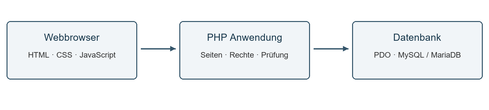

> Historischer Stand vor der Design- und Sicherheitsüberarbeitung. Aktuelle Änderungen und Nachweise: [Optimierungsbericht](Optimierungsbericht.md).

# FitFuerInfo
## Projektdokumentation zur Kurs und Raumverwaltung

Version: 1.0
Dokumentationsstand: 02.10.2026
Projektzeitraum: 11.09.2026 bis 16.10.2026
Projektbearbeiter: Hopkins Colby und Julian Diaconu
Projektorganisation: RWTH Aachen
Projektbetreuer: Herr Meier

Die Anwendung unterstützt die Verwaltung von Mitarbeitern, Kursprofilen, Räumen und Raumbuchungen. Im Mittelpunkt stehen die Eignungsprüfung eines Raumes, die Prüfung zeitlicher Überschneidungen und die Vergabe rollenbezogener Bearbeitungsrechte.

# Inhaltsverzeichnis
- [1 Einleitung und Projektbeschreibung](#1-einleitung-und-projektbeschreibung)
- [2 Zielsetzung und Meilensteine](#2-zielsetzung-und-meilensteine)
- [3 Projektdurchführung und Ergebnisse](#3-projektdurchführung-und-ergebnisse)
- [4 Abschlussbetrachtung und Ausblick](#4-abschlussbetrachtung-und-ausblick)

# 1 Einleitung und Projektbeschreibung
## 1.1 Projektumfeld und Ausgangssituation
FitFuerInfo ist ein Softwareprojekt von Hopkins Colby und Julian Diaconu im Projektumfeld der RWTH Aachen. Herr Meier betreut das Projekt. Der Bearbeitungszeitraum beginnt am 11.09.2026 und endet am 16.10.2026. Diese Dokumentation beschreibt den Stand vom 02.10.2026 und dient als Grundlage für die weitere Prüfung und Übergabe.

Bei der Planung von IT-Kursen müssen Teilnehmerzahl, verfügbare Rechnerarbeitsplätze, installierte Software und freie Raumzeiten zusammenpassen. Eine reine Terminübersicht bildet diese fachlichen Abhängigkeiten nicht vollständig ab. FitFuerInfo führt die zugehörigen Daten in einer lokalen Webanwendung zusammen und prüft die Voraussetzungen vor dem Speichern einer Buchung.

## 1.2 Projektauftrag und Nutzen
Gegenstand des Projekts ist eine browserbasierte Verwaltung für Mitarbeiterkonten, Kursprofile, Räume, Softwarezuordnungen und Raumbuchungen. Mitarbeiter sollen geeignete Räume für Kurse buchen können. Administratoren pflegen die zentralen Stammdaten und vergeben zusätzliche Bearbeitungsrechte. Der erwartete Nutzen liegt in einheitlichen Daten und nachvollziehbaren Buchungsentscheidungen: Eine Ablehnung benennt beispielsweise die fehlende Software oder die zu geringe Zahl an Arbeitsplätzen.

## 1.3 Projektumfang und Abgrenzung
Der Funktionsumfang umfasst Anmeldung und Abmeldung, selbstständige Passwortvergabe über Aktivierungslinks, Kursverwaltung, Raumverwaltung, Softwareverwaltung und Buchungsverwaltung. Kurse können mehrere Eigentümer besitzen; Räume können mehreren Mitarbeitern zur Bearbeitung zugeordnet sein. Eine Buchung verbindet einen Kurs mit einem Raum, einem Datum und einem Zeitintervall.

Nicht zum implementierten Umfang gehören Teilnehmeranmeldungen, Abrechnung, automatischer E-Mail-Versand, Kalenderexport und eine Anbindung an zentrale Identitätsdienste. Der Projektstand ist für die lokale Einrichtung mit XAMPP beschrieben. Die Veröffentlichung des Quellcodes auf GitHub ist von der Bereitstellung einer laufenden Webanwendung zu unterscheiden.

## 1.4 Technische Rahmenbedingungen
Die Projektdateien sind auf PHP 5.6 und XAMPP 5.6.36 ausgerichtet. Die Anwendung verwendet PHP, HTML, CSS, JavaScript und eine MySQL-kompatible Datenbank. Der Datenzugriff erfolgt über PDO. Es gibt keine Composer-Pakete, Frameworks oder externen CDN-Abhängigkeiten. Eine Prüfung mit einer anderen PHP-Version ersetzt keine Abnahme in der vorgesehenen Zielumgebung.

# 2 Zielsetzung und Meilensteine
## 2.1 Fachliche und technische Ziele
Das Hauptziel ist eine zentrale und nachvollziehbare Raumplanung für Kurse. Die folgende Zuordnung verbindet die Anforderungen mit überprüfbaren Kriterien.

| Ziel | Überprüfbares Kriterium |
| --- | --- |
| Zugriff begrenzen | Geschützte Seiten verlangen eine Anmeldung; Verwaltungsseiten prüfen die Administratorrolle. |
| Zuständigkeiten abbilden | Eigentümer bearbeiten ihre Kurse; freigegebene Bearbeiter bearbeiten ihre Räume. |
| Geeignete Räume buchen | Ein Raum bietet mindestens die im Kurs hinterlegte maximale Teilnehmerzahl an Rechnerarbeitsplätzen und alle erforderlichen Softwareprodukte. |
| Zeitkonflikte erkennen | Überschneidende Buchungen desselben Raums am selben Tag werden bei der Prüfung abgelehnt; unmittelbar anschließende Termine bleiben möglich. |
| Passwörter selbst vergeben | Mitarbeiter setzen ihr Passwort über einen zeitlich begrenzten Aktivierungslink; gespeichert werden Hashwerte. |
| Historie berücksichtigen | Kurse mit vergangenen Buchungen werden bei der Löschfunktion deaktiviert; künftige oder laufende Buchungen verhindern die Löschung beziehungsweise Deaktivierung. |

## 2.2 Meilensteine und Terminrahmen
Projektstart und Projektende bilden den verbindlichen zeitlichen Rahmen. Die fachlichen Meilensteine beschreiben die erforderlichen Ergebnisse. Ihr Status bezieht sich auf die am 02.10.2026 geprüften Dateien; eine formale Freigabe ist davon getrennt.

| Meilenstein | Ergebnis und Stand |
| --- | --- |
| M1 Projektstart am 11.09.2026 | Beginn des vorgegebenen Bearbeitungszeitraums. |
| M2 Datenmodell und Grundstruktur | SQL-Schema, zentrale Hilfsfunktionen und modulare Ordnerstruktur liegen vor. |
| M3 Fachliche Umsetzung | Konto-, Kurs-, Raum-, Software- und Buchungsfunktionen sind im Quellcode vorhanden. |
| M4 Prüfung und Dokumentation | Syntaxprüfung und ausgewählte Funktionstests durchgeführt; integrierte Anwendungsprüfung und Abnahme stehen aus. |
| M5 Abschluss bis 16.10.2026 | Zieltermin für die Prüfung in der Zielumgebung, die Bearbeitung offener Punkte und die Übergabe an Herrn Meier. |

## 2.3 Ressourcen und Wirtschaftlichkeit
Für die lokale Ausführung werden ein Rechner mit XAMPP und ein Browser benötigt. Der Projektstand verwendet keine externen kostenpflichtigen Anwendungsschnittstellen. Daraus folgt jedoch keine vollständige Kostenfreiheit: Einrichtung, Entwicklung, Betreuung und Wartung verursachen Aufwand. Eine belastbare Kostenrechnung muss tatsächliche Arbeitsstunden und die vereinbarten internen Stundensätze verwenden. Der mögliche Nutzen lässt sich später über den Zeitaufwand je Buchung und die Zahl vermiedener Fehlbuchungen bewerten.

# 3 Projektdurchführung und Ergebnisse
## 3.1 Aufbau der Anwendung
Die Anwendung besteht aus PHP-Seiten, die Anfragen verarbeiten und HTML ausgeben. Gemeinsame Funktionen liegen im Verzeichnis includes. Die Initialisierung setzt die Zeitzone Europe/Berlin, startet die Sitzung, ermittelt den Basispfad und lädt die Datenbankverbindung. Geschützte Seiten binden includes/auth.php ein. Dieses Skript ruft die zentrale Anmeldeprüfung auf.

Abbildung 1: Vereinfachter Aufbau der Anwendung. Darstellung, Verarbeitung und Datenzugriff sind logisch unterscheidbar; sie sind teilweise in denselben PHP-Dateien umgesetzt.

| Bestandteil | Aufgabe |
| --- | --- |
| users | Mitarbeiter anlegen, bearbeiten und Aktivierungslinks anzeigen. |
| courses | Kurse, Eigentümer und benötigte Software verwalten. |
| rooms | Räume, Rechnerarbeitsplätze, Software und Bearbeiter verwalten. |
| bookings | Buchungen prüfen, anlegen, anzeigen und löschen. |
| software | Zentrale Softwareliste administrieren. |
| includes und config | Initialisierung, Anmeldung, Hilfsfunktionen, Layout und PDO-Verbindung. |
| assets und sql | Lokale Gestaltung und JavaScript sowie Datenbankschema und Aktualisierungsskript. |

## 3.2 Technische Umsetzung und Abwägung
Die Umsetzung ohne Framework hält die Installation überschaubar und passt zur vorgesehenen PHP-Umgebung. Die klare Zuordnung der Seiten zu Fachmodulen erleichtert das Auffinden der Funktionen. Gleichzeitig müssen Validierung, Authentifizierung und Berechtigungsprüfungen durch die Anwendung selbst einheitlich umgesetzt werden.

PDO bündelt den Datenzugriff; vorbereitete SQL-Anweisungen trennen Parameter von der Abfragestruktur. Eine relationale Datenbank eignet sich für die verknüpften Stammdaten und Buchungen. Eine tabellarische Einzeldatei würde die fachlichen Beziehungen und parallelen Schreibzugriffe weniger gezielt abbilden. Diese Abwägung erläutert den bestehenden Entwurf und stellt keine nachträglich behauptete Produktauswahl dar.

## 3.3 Datenmodell und Datenintegrität
Das Datenbankschema umfasst zehn Tabellen. InnoDB und Fremdschlüssel bilden die Beziehungen zwischen Benutzern, Kursen, Räumen und Buchungen ab. Die Zeichencodierung utf8mb4 unterstützt die verwendeten deutschen Texte. Zusammengesetzte Primärschlüssel verhindern doppelte Zuordnungen in den Verbindungstabellen.

| Tabelle | Inhalt und Beziehung |
| --- | --- |
| users | Benutzername, Vorname, Nachname, Passwort-Hash, Rolle und Aktivstatus. |
| password_tokens | Hash des Aktivierungscodes, Benutzerbezug, Ablauf und Verwendungszeitpunkt. |
| courses | Kursname, Beschreibung, maximale Teilnehmerzahl, Ersteller und Aktivstatus. |
| course_owners | Verbindet Kurse und Benutzer als Eigentümer. |
| software | Eindeutige Bezeichnungen der verfügbaren Softwareprodukte. |
| course_software | Verbindet Kurse mit ihrer benötigten Software. |
| rooms | Eindeutiger Raumname, Rechneranzahl und Beschreibung. |
| room_software | Verbindet Räume mit ihrer installierten Software. |
| room_editors | Verbindet Räume mit berechtigten Bearbeitern. |
| bookings | Raum, Kurs, Ersteller, Datum, Startzeit und Endzeit. |

Ein Benutzer kann mehrere Kurse erstellen und mehrere Buchungen anlegen. Ein Kurs kann mehrere Eigentümer und Softwareanforderungen besitzen. Ein Raum kann mehrere Softwareprodukte und Bearbeiter haben. Jede Buchung verweist genau auf einen Kurs, einen Raum und einen erstellenden Benutzer.

Die Tabelle bookings besitzt einen gemeinsamen Index für Raum und Datum. Er unterstützt die Suche nach Belegungen eines Raumes an einem bestimmten Tag. Weitere Indizes betreffen unter anderem Kurse, Benutzer und Aktivstatus. Eine gemessene Aussage zur Leistung unter größerer Last ist damit noch nicht verbunden.

## 3.4 Erhalt von Beziehungen und Historie
Beim Entfernen eines Kurses prüft die Anwendung zuerst auf laufende oder zukünftige Buchungen. Liegen solche Buchungen vor, wird der Vorgang abgelehnt. Bei ausschließlich vergangenen Buchungen setzt sie den Kurs inaktiv; ohne Buchungen ist eine physische Löschung möglich. Räume mit Buchungen lassen sich nicht löschen.

Mehrteilige Änderungen an Kursen, Räumen und Zuordnungen verwenden Transaktionen. Beispielsweise werden die Kursdaten und die zugehörige Softwareliste gemeinsam gespeichert. Bei einem Datenbankfehler wird die Transaktion zurückgesetzt. Diese Behandlung schützt zusammengehörige Änderungen vor einem nur teilweise gespeicherten Zustand.

## 3.5 Rollen und Berechtigungen
Das System unterscheidet die Kontorollen employee und admin. Eigentümerschaft an einem Kurs und Bearbeitungsrechte an einem Raum sind zusätzliche objektbezogene Zuordnungen. Die Oberfläche zeigt passende Aktionen an; die serverseitige Prüfung entscheidet auch bei direkten Seitenaufrufen über den Zugriff.

| Aktion | Mitarbeiter | Administrator |
| --- | --- | --- |
| Kurse und Räume ansehen | Ja, nach Anmeldung | Ja |
| Kurse anlegen | Ja | Ja |
| Kurse bearbeiten oder entfernen | Nur als Eigentümer; fachliche Löschregeln gelten | Alle; fachliche Löschregeln gelten |
| Räume anlegen oder löschen | Nein | Ja; gebuchte Räume nicht löschbar |
| Räume bearbeiten | Nur bei zugewiesenem Bearbeitungsrecht | Alle |
| Räume buchen | Ja | Ja |
| Buchungen löschen | Nur eigene | Alle |
| Konten, Software und Rechte verwalten | Nein | Ja |

## 3.6 Kontoanlage und Passwortvergabe
Die einmalige Einrichtung erfolgt über setup_admin.php. Sobald ein Administrator existiert, wird über diese Seite kein weiterer Administrator angelegt. Nach der Einrichtung soll die Datei entfernt oder umbenannt werden. Neue Mitarbeiterkonten legt ein Administrator ohne vorgegebenes Passwort an.

Die Anwendung erzeugt einen Aktivierungscode und speichert dessen SHA-256-Hash in password_tokens. Der Link mit dem Originalcode erscheint einmalig für den Administrator. Der Code ist sieben Tage gültig; neu erzeugte Codes machen vorherige unbenutzte Codes ungültig. Mitarbeiter wählen über set_password.php ihr eigenes Passwort. Passwortspeicherung und Entwertung der Codes erfolgen in einer Transaktion.

Der Login akzeptiert nur aktive Konten mit gesetztem Passwort und erfolgreicher Prüfung durch password_verify(). Nach erfolgreicher Anmeldung wird die Sitzungskennung erneuert. Bei nachfolgenden geschützten Aufrufen kontrolliert requireLogin(), ob das Konto weiterhin aktiv ist.

Die Rolle wird beim Login in der Sitzung gespeichert. Eine spätere Rollenänderung wird in requireLogin() nicht erneut aus der Datenbank übernommen. Für eine sofort wirksame Rechteänderung ist daher eine zusätzliche Aktualisierung oder Beendigung bestehender Sitzungen vorzusehen.

## 3.7 Buchungsprüfung
Eine neue Buchung wird in bookings/create.php erfasst. Nach der CSRF-Prüfung liest die Anwendung Kurs, Raum, Datum sowie Beginn und Ende ein. Die zentrale Funktion validateBooking() prüft anschließend die fachlichen Voraussetzungen. Erst wenn keine Fehlermeldung vorliegt, wird die Buchung gespeichert.

| Prüfschritt | Bedingung und Reaktion |
| --- | --- |
| Eingaben prüfen | Gültige Kennungen, Kalenderdatum und Uhrzeiten verlangen. |
| Zeitraum prüfen | Die Startzeit muss vor der Endzeit liegen. |
| Stammdaten prüfen | Raum und Kurs müssen existieren; der Kurs muss aktiv sein. |
| Kapazität prüfen | Rechneranzahl des Raums muss mindestens der maximalen Teilnehmerzahl des Kurses entsprechen. |
| Software prüfen | Jede benötigte Kurssoftware muss dem Raum zugeordnet sein. Fehlende Produkte werden namentlich gemeldet. |
| Belegung prüfen | Für denselben Raum und Tag darf keine zeitliche Überschneidung bestehen. |
| Speichern | Raum, Kurs, Ersteller, Datum und normalisierte Zeiten in bookings eintragen. |

Eine Überschneidung liegt vor, wenn der Beginn einer bestehenden Buchung vor dem neuen Ende und ihr Ende nach dem neuen Beginn liegt. Die strikten Vergleiche erlauben direkt anschließende Termine. Auf eine Buchung von 10:00 bis 12:00 Uhr darf deshalb eine Buchung ab 12:00 Uhr folgen. Eine Buchung von 11:00 bis 13:00 Uhr würde bei der Prüfung abgelehnt.

Beispiel: Ein Kurs mit maximal 15 Teilnehmern benötigt Wireshark. Ein Raum mit zehn Rechnerarbeitsplätzen erfüllt die Kapazitätsprüfung nicht. Ein Raum mit 20 Arbeitsplätzen ohne Wireshark erfüllt die Softwareprüfung nicht. Erst ein passend ausgestatteter Raum mit freiem Zeitintervall erfüllt alle genannten Bedingungen.

## 3.8 Grenzen der bisherigen Buchungslogik
Konfliktprüfung und Einfügen erfolgen nacheinander ohne eine gemeinsame Sperre. Zwei gleichzeitige Anfragen können deshalb denselben freien Zeitraum erkennen und beide speichern. Vor einer Mehrbenutzerfreigabe ist die Prüfung durch eine passende Transaktions- und Sperrstrategie abzusichern und mit parallelen Anfragen zu testen.

Änderungen an Rechneranzahl, Kursgröße oder Softwarezuordnungen prüfen bestehende Buchungen nicht erneut auf Eignung. Außerdem gibt es keine ausdrückliche Sperre für Buchungen in der Vergangenheit. Diese fachlichen Regeln müssen mit Herrn Meier abgestimmt werden. Die vorhandene Prüfung beschreibt daher die Eignung zum Zeitpunkt der einzelnen Buchungsanfrage.

## 3.9 Schutzmaßnahmen und offene Punkte
Die Anwendung maskiert dynamische HTML-Ausgaben über die Hilfsfunktion e(). Verändernde Formulare verwenden sitzungsbezogene CSRF-Token. Datenbankzugriffe mit Benutzereingaben verwenden vorbereitete Anweisungen. Passwörter werden mit password_hash() gespeichert und mit password_verify() geprüft. Die lokale Datenbankkonfiguration ist durch .gitignore vom Repository ausgeschlossen; veröffentlicht wird lediglich eine Beispieldatei.

Diese Maßnahmen sind gezielt zu bewerten. Eine bestandene Syntaxprüfung beweist weder die Wirksamkeit sämtlicher Zugriffskontrollen noch eine sichere Konfiguration der Betriebsumgebung.

| Befund im Projektstand | Folgeschritt vor einer erweiterten Nutzung |
| --- | --- |
| Passwortregel erlaubt vier Zeichen mit Kleinbuchstabe und Zahl. | Eine angemessene Passwortregel festlegen und die Funktion validatePassword() entsprechend überarbeiten. |
| Bei fehlendem OpenSSL existiert ein Zufalls-Fallback mit uniqid() und mt_rand(). | Kryptografisch geeignete Zufallswerte verbindlich voraussetzen und bei fehlender Unterstützung abbrechen. |
| display_errors ist in includes/init.php eingeschaltet. | In der Betriebsumgebung ausschalten und Fehler nur im geschützten Protokoll erfassen. |
| Die Beispielkonfiguration verwendet root mit leerem Passwort. | Für den tatsächlichen Betrieb ein eigenes Datenbankkonto mit passenden Rechten und Passwort verwenden. |
| Rollen bleiben in bestehenden Sitzungen gespeichert. | Rollenänderungen bei weiteren Aufrufen berücksichtigen oder Sitzungen gezielt ungültig machen. |
| Tokenprüfung erfolgt vor der Transaktion zur Passwortänderung. | Gleichzeitige Einlösung durch atomare Prüfung und Entwertung absichern. |

## 3.10 Qualitätssicherung und Prüfumgebung
Am 02.10.2026 wurden alle 28 PHP-Dateien mit PHP 8.2.12 auf Syntaxfehler geprüft. Die Prüfung endete für jede Datei ohne Syntaxfehler. Zusätzlich wurden 20 gezielte Prüfungen der vorhandenen Hilfsfunktionen ohne Datenbank ausgeführt; alle 20 bestanden.

Die Funktionsprüfungen umfassten gültige und ungültige Kalenderdaten, Zeitgrenzen, Zeitnormalisierung, die vorhandene Passwortregel, HTML-Maskierung, die Länge des Tokenhashes, die Erkennung eines nicht gesetzten Passworts, passende und falsche CSRF-Token sowie Löschrechte an Buchungen. Ein erfolgreicher Test der schwachen Mindestpasswortregel bestätigt nur die aktuelle Umsetzung, nicht deren Eignung für den Betrieb.

Die Ergebnisse beziehen sich auf die genannte Prüfumgebung. Die Ausführung unter PHP 5.6, Datenbankintegration, Browserabläufe, konkurrierende Schreibzugriffe und eine formale Abnahme sind noch gesondert durchzuführen. Das Repository enthält mit TESTPLAN.md bereits eine Grundlage für die manuelle Anwendungsprüfung.

## 3.11 Testfälle für die fachliche Abnahme
Für die folgenden Tests werden ein Administrator, zwei Mitarbeiter, ein kleiner und ein ausreichend großer Raum sowie ein Kurs mit Softwarebedarf benötigt. Die Testfälle ergänzen die bereits ausgeführten isolierten Prüfungen. Ihr Status lautet jeweils offen; die Tabelle enthält Soll-Ergebnisse.

| Fall | Durchführung und erwartetes Ergebnis |
| --- | --- |
| T01 Anmeldung | Gültiges Konto anmelden; Dashboard erscheint. Falsches Passwort und deaktiviertes Konto werden abgelehnt. |
| T02 Aktivierung | Passwort über gültigen Link setzen; Wiederverwendung und abgelaufenen Link ablehnen. |
| T03 Kursrechte | Mitarbeiter B ruft den fremden Kurs von A direkt zur Bearbeitung auf; Änderung wird verhindert. |
| T04 Raumrechte | Nur Administratoren legen Räume an; zugewiesene Bearbeiter dürfen ihren Raum ändern. |
| T05 Kapazität | Kurs mit 15 Teilnehmern in einem Raum mit zehn Arbeitsplätzen buchen; Buchung wird abgelehnt. |
| T06 Software | Wireshark-Kurs in einem Raum ohne Wireshark buchen; fehlende Software wird benannt. |
| T07 Zeitkonflikt | Überlappenden Termin ablehnen und direkt anschließenden Termin zulassen. |
| T08 Buchung löschen | Ersteller und Administrator dürfen löschen; anderer Mitarbeiter darf nicht löschen. |
| T09 Historie | Kurs mit zukünftigen Buchungen beibehalten; Kurs mit ausschließlich vergangenen Buchungen deaktivieren. |
| T10 Gleichzeitigkeit | Zwei parallele Buchungen desselben Intervalls sowie parallele Tokeneinlösung prüfen; bekannte Lücken gezielt nachstellen. |
| T11 Formulare | Fehlendes oder falsches CSRF-Token darf keine Änderung auslösen. |

Für jeden Fall sind tatsächliches Ergebnis, Testdatum, Prüfer und gegebenenfalls eine Fehlerreferenz zu protokollieren. Ein Fehlschlag führt zur Korrektur und zur Wiederholung des betroffenen Ablaufs. Die Abnahme setzt voraus, dass die vereinbarten Anforderungen erfüllt sind und verbleibende Einschränkungen ausdrücklich bewertet wurden.

## 3.12 Ergebnisstand
Die Module, das SQL-Schema, die Installationsanleitung und der manuelle Testplan liegen vor. Die Syntax und ausgewählte Hilfsfunktionen wurden erfolgreich geprüft. Der fachliche Umfang ist im Quellcode nachvollziehbar umgesetzt; die bekannten Grenzen bei Parallelität und nachträglichen Stammdatenänderungen verhindern jedoch eine pauschale Aussage, dass alle Buchungskonflikte ausgeschlossen seien.

## 3.13 Installation und Übergabe
Die nachfolgende Reihenfolge beschreibt eine neue lokale Installation. Ein SQL-Import oder die Einrichtung eines Administrators darf nicht unkontrolliert gegen eine bereits genutzte Datenbank erfolgen.

1. Apache und MySQL beziehungsweise MariaDB in der vorgesehenen XAMPP-Umgebung starten.
2. Den Projektinhalt unter C:\xampp\htdocs\fitfuerinfo ablegen.
3. Das Schema sql/database.sql in eine neue Datenbankumgebung importieren. Es legt fitfuerinfo_db, zehn Tabellen und Beispielsoftware an.
4. config/database.example.php nach config/database.php kopieren und die tatsächlichen Verbindungsdaten eintragen.
5. Lokal http://localhost/fitfuerinfo/setup_admin.php aufrufen und den ersten Administrator anlegen.
6. setup_admin.php nach erfolgreicher Einrichtung entfernen oder umbenennen.
7. Über http://localhost/fitfuerinfo/ anmelden und Mitarbeiter, Räume, Softwarezuordnungen und Kurse einrichten.
8. Die fachlichen Testfälle aus Abschnitt 3.11 und TESTPLAN.md durchführen und Ergebnisse protokollieren.

Bei einer älteren Datenbank ist vor Anwendung von sql/update_password_tokens.sql deren Schema zu prüfen und eine Sicherung anzulegen. Das Aktualisierungsskript ist für die Erweiterung um Passwortcodes vorgesehen. Das vollständige Schema ist kein beliebig wiederholbares Datenmigrationsverfahren.

## 3.14 Übergabeumfang und Betrieb
Zur Übergabe gehören der Quellcode, die SQL-Skripte, die Beispieldatei für die Datenbankverbindung, README.md, TESTPLAN.md und diese Projektdokumentation. Das Zielrepository lautet github.com/silienthpp-glitch/FitFuerInfo. Die echten Datenbankzugangsdaten werden separat in der lokalen Konfiguration verwaltet.

Vor einer Freigabe sind Zuständigkeiten für Kontenverwaltung, Sicherungen, Wiederherstellung und Fehlerbearbeitung festzulegen. Datenbank und Anwendungskonfiguration müssen in das Sicherungskonzept einbezogen werden. Eine Wiederherstellung sollte in einer getrennten Testumgebung geprüft werden. Ein Repository ersetzt keine Sicherung der im Betrieb erzeugten Buchungsdaten.

## 3.15 Nachweise im Projekt
Die beschriebenen Funktionen lassen sich den Projektdateien direkt zuordnen. README.md erläutert Installation und Rollen; TESTPLAN.md beschreibt manuelle Testabläufe. sql/database.sql enthält Tabellen und Beziehungen. includes/functions.php enthält Validierung, Rechteprüfungen und Tokenfunktionen; includes/init.php enthält die Initialisierung.

login.php und set_password.php bilden Anmeldung und Passwortvergabe ab. bookings/create.php und bookings/delete.php verarbeiten Buchungen. courses/delete.php regelt Löschung und Deaktivierung von Kursen. Die Bearbeitungsseiten unter courses und rooms zeigen die Transaktionen und Zuordnungsänderungen. Diese Dateien bilden die technischen Belege für die vorstehenden Beschreibungen.

# 4 Abschlussbetrachtung und Ausblick
## 4.1 Soll und Ist Vergleich
FitFuerInfo bündelt die für die Raumplanung benötigten Informationen in einer gemeinsamen Anwendung. Mitarbeiter, Kurse, Räume und Softwareprodukte sind über ein relationales Modell miteinander verbunden. Die Buchungsprüfung berücksichtigt Kapazität, Softwareausstattung und vorhandene Zeitintervalle. Objektbezogene Berechtigungen ermöglichen die Mitarbeit an freigegebenen Kursen und Räumen.

| Projektziel | Bewertung zum 02.10.2026 |
| --- | --- |
| Zentrale Stammdatenverwaltung | Im Quellcode vorhanden; integrierte Prüfung offen. |
| Rollenbezogene Bearbeitung | Serverseitige Prüfungen vorhanden; Sitzungsrollen bei Änderungen beachten. |
| Eignungsprüfung von Räumen | Prüfregeln für Kapazität und Software vorhanden; Datenbanktest offen. |
| Prüfung auf Zeitüberschneidungen | Für einzelne Prüfabläufe implementiert; Parallelzugriffe noch abzusichern. |
| Nachvollziehbare Übergabe | Installationsanleitung, Testplan und Projektdokumentation liegen vor. |
| Fachliche Freigabe | Nach Durchführung der Abnahmetests mit Herrn Meier zu entscheiden. |

## 4.2 Bewertung der Umsetzung
Die Modulstruktur und die zentralen Hilfsfunktionen schaffen eine verständliche Grundlage für die Weiterentwicklung. Die Verknüpfung von Kursanforderungen und Raumausstattung macht die Auswahl fachlich begründbar. Die Aufbewahrung vergangener Kursbuchungen unterstützt die Nachvollziehbarkeit der Nutzung.

Der wesentliche weitere Entwicklungsbedarf betrifft die Konsistenz bei gleichzeitigen Anfragen und nachträglichen Änderungen an Stammdaten. Auch Passwortregeln, Zufallswerterzeugung und Sitzungsrechte sind vor einer erweiterten Nutzung zu überarbeiten. Diese Punkte ergeben sich unmittelbar aus den vorhandenen Abläufen und sollten vor zusätzlichen Komfortfunktionen bearbeitet werden.

## 4.3 Weitere Schritte bis zum Projektabschluss
Bis zum 16.10.2026 stehen die integrierte Prüfung in der vorgesehenen Umgebung, die Priorisierung und Bearbeitung der offenen Punkte sowie die Abnahme mit Herrn Meier an. Die Testergebnisse sind mit Datum und Prüfer zu dokumentieren. Nach jeder fachlichen Korrektur müssen die betroffenen Abläufe erneut geprüft werden.

Für eine spätere Ausbaustufe kommen eine Kalenderansicht, ein Export von Buchungen und eine nachvollziehbare Änderungshistorie infrage. Zuvor sollte eine zeitgemäße Zielumgebung festgelegt und die Kompatibilität darin vollständig geprüft werden. Der Projektabschluss erfolgt mit einem dokumentierten Funktionsstand, bekannten Einschränkungen und klaren Zuständigkeiten für den weiteren Betrieb.
